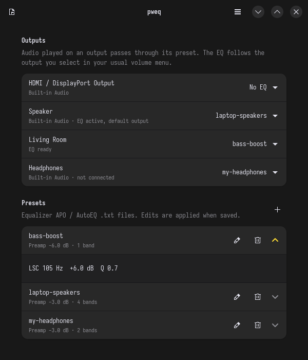

<p align="center">
  
</p>

<h1 align="center">pweq</h1>

<p align="center">
  Per-output parametric EQ for PipeWire. Lightweight, file-based, AutoEQ-compatible.
</p>

<p align="center">
  <a href="https://github.com/daer68/pweq/actions/workflows/ci.yml"></a>
  <a href="LICENSE"></a>
</p>

<p align="center">
  
</p>

pweq gives every audio output (laptop speakers, headphones, HDMI, AirPlay…)
its own parametric EQ preset, and switches to the right one automatically
when you change outputs.

Presets are plain [AutoEQ](https://github.com/jaakkopasanen/AutoEq) /
Equalizer APO `.txt` files. The filtering runs inside PipeWire's builtin
filter-chain, with no separate audio app sitting in the signal path. On the
author's laptop that took EQ from about **20% of a CPU core with EasyEffects
to under 1%**, which you notice in battery life.

## Features

- **One preset per output.** Plug in headphones and their EQ applies; unplug
  and the speakers get theirs back.
- **Follows your normal output switching.** Pick outputs in your usual volume
  menu; pweq moves the audio through the matching EQ. Picking the real
  device instead of its *(EQ: …)* entry turns the EQ off for it.
- **AutoEQ / Equalizer APO format.** Paste a `ParametricEQ.txt` from AutoEQ or
  squig.link and you're done.
- **Edit presets in any text editor.** Changes apply as soon as you save.
- **Low overhead.** The daemon uses no CPU between PipeWire events, and each
  EQ is a few biquad filters inside PipeWire.
- **GTK 4 / libadwaita GUI**, plus a small CLI for scripts.
- **EasyEffects import**: presets and per-device autoload rules.
- AirPlay and other network speakers keep their preset when their IP changes.

## Requirements

- Linux with **PipeWire ≥ 1.0** and **WirePlumber** (tested with PipeWire 1.6, WirePlumber 0.5)
- **Python ≥ 3.10**
- For the GUI: GTK 4, libadwaita and PyGObject
  - Arch: `pacman -S python-gobject gtk4 libadwaita`
  - Debian/Ubuntu: `apt install python3-gi gir1.2-gtk-4.0 gir1.2-adw-1`
  - Fedora: `dnf install python3-gobject gtk4 libadwaita`

The daemon and CLI only need the Python standard library and PipeWire's
command-line tools (`pipewire`, `pw-dump`, `pw-metadata`).

## Install

```sh
git clone https://github.com/daer68/pweq.git
cd pweq
./install.sh
```

This installs into `~/.local` (no root) and enables the `pweq` systemd user
service. Re-run it to upgrade. See `./install.sh --help` for system-wide
installs and packaging options.

**Arch Linux:** a PKGBUILD is in [`packaging/arch`](packaging/arch):

```sh
cd packaging/arch && makepkg -si
systemctl --user enable --now pweq.service pweq-reload.path
```

**Uninstall:** `./install.sh --uninstall` (add `--purge` to also delete your presets).

## Quick start

1. Get a preset. For headphones, search [AutoEQ](https://autoeq.app) or
   [squig.link](https://squig.link) and download the *Parametric EQ*
   `.txt`. Or start from [`examples/`](examples).
2. Open **pweq** from your app menu and click **+** to import it.
3. Pick the preset next to the output it's for.

That's it. Select outputs as you normally would; in your volume menu the
EQ'd variant shows up as e.g. *Speaker (EQ: laptop-speakers)*. Selecting
plain *Speaker* instead means "no EQ" until you pick the EQ entry again or
the device reconnects.

Coming from EasyEffects? Use **menu → Import EasyEffects presets**, then see
[Migrating from EasyEffects](docs/migrating-from-easyeffects.md).

## Command line

```text
pweq                          open the GUI
pweq status                   outputs, assigned presets and active EQ sinks
pweq import FILE [NAME]       add an AutoEQ / APO .txt preset
pweq assign OUTPUT PRESET     OUTPUT is a node name or description; PRESET may be "none"
pweq import-easyeffects       import EasyEffects presets and autoload rules
pweq reload                   make the daemon re-read presets and assignments
pweq daemon                   run the auto-follow daemon (normally started by systemd)
pweq --version
```

Example:

```sh
pweq import ~/Downloads/"Sennheiser HD 600 ParametricEQ.txt" hd600
pweq assign Headphones hd600
pweq status
```

## Documentation

- [Preset format](docs/presets.md): syntax, filter types, avoiding clipping, where to find presets
- [How it works](docs/how-it-works.md): architecture, output switching, design choices
- [Troubleshooting](docs/troubleshooting.md)
- [Migrating from EasyEffects](docs/migrating-from-easyeffects.md)

## Files

| Path | Contents |
|---|---|
| `~/.config/pweq/presets/*.txt` | your presets |
| `~/.config/pweq/assignments.json` | output → preset mapping |
| `$XDG_RUNTIME_DIR/pweq/*.conf` | generated PipeWire configs (recreated on every start) |

Logs: `journalctl --user -u pweq`.

## Limitations

- EQ sinks are stereo; one curve is used for both channels.
- No graphical curve editor: presets are text, and the GUI lists their bands.
- Runs only while the `pweq` user service runs. If it's stopped, audio simply
  plays without EQ.

## Development

```sh
python3 -m unittest discover -s tests   # tests (no PipeWire needed)
pipx run ruff check .                   # lint
PWEQ_CONFIG_DIR=/tmp/pweq-test python3 -m pweq status   # run from the checkout with a scratch config
```

Issues and pull requests are welcome. For bugs, please include `pweq status`
output and `journalctl --user -u pweq -b`.

## License

pweq is free software: you can redistribute it and/or modify it under the terms of the
[GNU General Public License](LICENSE) as published by the Free Software Foundation, either
version 3 of the License, or (at your option) any later version.
